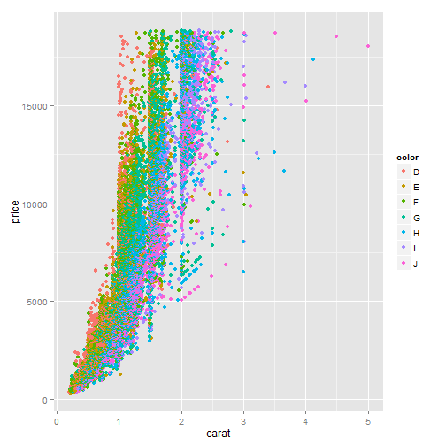
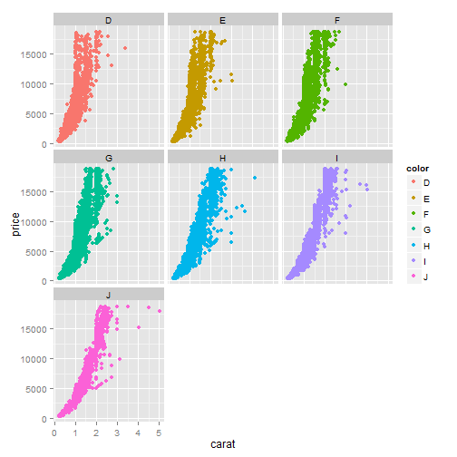

% Hausaufgabe 16
% Martin Becker <Beckerm3@students.uni-marburg.de>
% 2014-06-11

Falls die Umlaute in dieser und anderen Dateien nicht korrekt dargestellt werden, sollten Sie File > Reopen with Encoding > UTF-8 sofort machen (und auf jeden Fall ohne davor zu speichern), damit die Enkodierung korrekt erkannt wird! 


# Die nächsten Punkte sollten beinahe automatisch sein...
1. Kopieren Sie diese Datei in Ihren Ordner (das können Sie innerhalb RStudio machen oder mit Explorer/Finder/usw.) und öffnen Sie die Kopie. Ab diesem Punkt arbeiten Sie mit der Kopie. Die Kopie bitte `hausaufgabe16.Rmd` nennen und nicht `Kopie...`
2. Sie sehen jetzt im Git-Tab, dass die neue Datei als unbekannt (mit gelbem Fragezeichen) da steht. Geben Sie Git Bescheid, dass Sie die Änderungen in der Datei verfolgen möchten (auf Stage klicken).
3. Machen Sie ein Commit mit den bisherigen Änderungen (schreiben Sie eine sinnvolle Message dazu -- sinnvoll bedeutet nicht unbedingt lang) und danach einen Push.
4. Ersetzen Sie meinen Namen oben mit Ihrem. Klicken auf Stage, um die Änderung zu merken.
5. Ändern Sie das Datum auf heute. (Seien Sie ehrlich! Ich kann das sowieso am Commit sehen.)
6. Sie sehen jetzt, dass es zwei Symbole in der Status-Spalte gibt, eins für den Zustand im *Staging Area* (auch als *Index* bekannt), eins für den Zustand im Vergleich zum Staging Area. Sie haben die Datei modifiziert, eine Änderung in das Staging Area aufgenommen, und danach weitere Änderungen gemacht. Nur Änderungen im Staging Area werden in den Commit aufgenommen.
7. Stellen Sie die letzten Änderungen auch ins Staging Area und machen Sie einen Commit (immer mit sinnvoller Message!).
8. Vergessen Sie nicht am Ende, die Lizenz ggf. zu ändern!

# Diamonds are forever 
Bisher haben Sie von mir mehr oder weniger vollständige Analysen bekommen, bei denen Sie im Prinzip nur einzelne Schritte einfügen müssten. Es wird allerdings langsam Zeit, dass Sie eine eigenständige Analyse ausführen. Sie haben das bei der Analyse vom Priming Experiment mittels ANOVA fast gemacht, aber auch da haben Sie viel von mir vorgefertigt bekommen. Für die Aufgaben heute werden Sie den Datensatz `diamonds` aus `ggplot2` bearbeiten. Schauen Sie sich die Beschreibung des Datensatzes an


```r
`?`(diamonds)
```

<div style="border: 2px solid black; padding: 5px; font-size: 80%;">
<!DOCTYPE html PUBLIC "-//W3C//DTD HTML 4.01 Transitional//EN">
<html><head><title>R: Prices of 50,000 round cut diamonds</title>
<meta http-equiv="Content-Type" content="text/html; charset=utf-8">
<link rel="stylesheet" type="text/css" href="">
</head><body>

<table width="100%" summary="page for diamonds"><tr><td>diamonds</td><td align="right">R Documentation</td></tr></table>

<h2>Prices of 50,000 round cut diamonds</h2>

<h3>Description</h3>

<p>A dataset containing the prices and other attributes of
almost 54,000 diamonds. The variables are as follows:
</p>


<h3>Format</h3>

<p>A data frame with 53940 rows and 10 variables</p>


<h3>Details</h3>

 <ul>
<li><p> price. price in US dollars
(\$326&ndash;\$18,823) </p>
</li>
<li><p> carat. weight of the diamond
(0.2&ndash;5.01) </p>
</li>
<li><p> cut. quality of the cut (Fair, Good,
Very Good, Premium, Ideal) </p>
</li>
<li><p> colour. diamond colour,
from J (worst) to D (best) </p>
</li>
<li><p> clarity. a measurement
of how clear the diamond is (I1 (worst), SI1, SI2, VS1,
VS2, VVS1, VVS2, IF (best)) </p>
</li>
<li><p> x. length in mm
(0&ndash;10.74) </p>
</li>
<li><p> y. width in mm (0&ndash;58.9) </p>
</li>
<li><p> z. depth
in mm (0&ndash;31.8) </p>
</li>
<li><p> depth. total depth percentage = z /
mean(x, y) = 2 * z / (x + y) (43&ndash;79) </p>
</li>
<li><p> table. width
of top of diamond relative to widest point (43&ndash;95) </p>
</li></ul>


</body></html>

</div>

Die Aufgabe ist: eine Ausgangsfrage und die darauf folgenden Anschlussfragen statistisch zu beantworten. Sie können auch einige kleinere Fragen als Gruppe behandeln. Sie haben frei Wahl von Methoden und Fragen, aber sie müssen natürlich zueinander passen!

Mögliche Ausgangsfragen sind unter anderem:

* Was bestimmt den Preis eines Diamanten?
* Was bestimmt das Gewicht eines Diamanten? Hat Farbe oder Klarheit eine Auswirkung daruf oder bloß Volumen?
* Gibt es einen Zusammenhang zwischen den verschieden Dimensionen ("Längen")? 
* Gibt es einen Zusammenhang zwischen Farbe und Klarheit? Zwischen Farbe und Carat? Zwischen Farbe und Tiefe?
* ...

*Vergessen Sie dabei nicht, dass wir bisher nur Methoden gelernt haben, wo die abhängige Variable zumindest intervallskaliert ist!*

Sie können sich auch [das *ggplot* Buch](http://dx.doi.org/10.1007/978-0-387-98141-3) zur Inspiration anschauen, v.a. Abbildungen 4.7, 4.8, 4.9, 5.2, 5.3, 5.4, 5.6, 5.14, 7.16, 9.1  und Kapitel 2.2-2.5 könnten inspirierend wirken. Den Code zur Erstellung der Figuren findet man immer im Haupttext.

**Originale Fragestellungen und Auswertungen werden mit Bonuspunkten belohnt!** 
# Bonuspunkte = Schoki? :)

Hier ein paar Grafiken (auch im Buch zu finden):

```r
ggplot(diamonds, aes(x = carat, y = price, color = color)) + geom_point()
```

 

```r
ggplot(diamonds, aes(x = carat, y = price, color = color)) + geom_point(alpha = 0.3)
```

 

```r
ggplot(diamonds, aes(x = carat, y = price, color = color)) + geom_point() + 
    facet_wrap(~color)
```

 


# Noch eine Überlegung
Haben Sie dabei explorativ oder konfirmativ gearbeitet? Was hat das für eine Auswirkung auf die Interpretation der Ergebnisse?

# Lizenz
Dieses Werk ist lizenziert unter einer CC-BY-NC-SA Lizenz.

# Überblick über die Daten
Um einen ersten Überblick über die Struktur der Datei "diamond" zu bekommen, lasse ich mir die Spaltennamen ausgeben:

```r
colnames(diamonds)
```

```
##  [1] "carat"   "cut"     "color"   "clarity" "depth"   "table"   "price"  
##  [8] "x"       "y"       "z"
```

Und als nächstes schaue ich mir die ersten 10 Zeilen des Datensatzes an:

```r
head(diamonds, 10)
```

```
##    carat       cut color clarity depth table price    x    y    z
## 1   0.23     Ideal     E     SI2  61.5    55   326 3.95 3.98 2.43
## 2   0.21   Premium     E     SI1  59.8    61   326 3.89 3.84 2.31
## 3   0.23      Good     E     VS1  56.9    65   327 4.05 4.07 2.31
## 4   0.29   Premium     I     VS2  62.4    58   334 4.20 4.23 2.63
## 5   0.31      Good     J     SI2  63.3    58   335 4.34 4.35 2.75
## 6   0.24 Very Good     J    VVS2  62.8    57   336 3.94 3.96 2.48
## 7   0.24 Very Good     I    VVS1  62.3    57   336 3.95 3.98 2.47
## 8   0.26 Very Good     H     SI1  61.9    55   337 4.07 4.11 2.53
## 9   0.22      Fair     E     VS2  65.1    61   337 3.87 3.78 2.49
## 10  0.23 Very Good     H     VS1  59.4    61   338 4.00 4.05 2.39
```


# Fragestellung
* Gibt es einen Parameter, der sich besonders deutlich auf den Preis eines Diamanten auswirkt?
Und zu guter Letzt:
* Ist der Längste auch der Teuerste?

#Antworten:
* Gibt es einen Parameter, der sich besonders deutlich auf den Preis eines Diamanten auswirkt?

Das Interessante ist hier der obere Preisbereich - daher wird der X-Achsenabschnitt auf die oberen 1000 Einheiten begrenzt (xlim=c(17000,18000) ).

Untersucht werden sollen folgende Eigenschaften:
* Carat
* Cut
* Color
* Clarity
Auf der Y-Achse wird erstmal das Gewicht (Carat) aufgezeigt.
Den Datenpunkte werden unterschiedliche Farben(für Color)/Formen(für Cut)/Größen(für Clarity) zugeteilt. 
Daraus ergibt sich folgende Grafik:

```r
qplot(price, carat, data = diamonds, size = clarity, color = color, shape = cut, 
    xlim = c(17000, 18000))
```

```
## Warning: Removed 53534 rows containing missing values (geom_point).
```

 


Aus dieser Grafik ergibt sich folgendes Ergebnis für die teuersten Diamanten:
* Die Größe hat keinen zu großen Einfluss auf den Preis (der größte Diamant ist NICHT der teuerste!)
* die klarsten Diamanten (IF) finden sich eher bei den kleineren Diamanten (1-2 ct.)
* Die Farbe scheint auch etwas mit der Größe des Diamanten zu tun haben. Im unteren ct.-Bereich finden sich vermehrt Diamanten der Farbe "D" und "F", im mittleren Bereich "H" und "G". Der obere Bereich wird dominiert von der Farbe "J"
* Die Schlifformen sind über den gesamten Bereich verbreitet, wobei "Very Good", "Premium" und "Ideal" offenbar dominieren.

* Ist der Längste auch der Teuerste? :D

```r
max(diamonds$x)
```

```
## [1] 10.74
```

```r
subset(diamonds, diamonds$x == "10.74")$price
```

```
## [1] 18018
```

```r
max(diamonds$price)
```

```
## [1] 18823
```

Der längste Diamant ist ganz klar nicht der teuerste... Aber er gehört schon eher zu den teureren. 
Da stellt sich die Frage: Gehört er zur top-100 der teuersten Diamanten dieses Datasets?

```r
top100 <- tail(sort(diamonds$price), 100)
range(top100)
```

```
## [1] 18508 18823
```

Nein, auch im Bereich der preislichen Top-100 ist der längste Diamant zu finden.

Interessant ist in diesem Zusammenhang, wenn man sich auch mal die Breite (Y) anschaut:

```r
max(diamonds$y)
```

```
## [1] 58.9
```

Soso.... der längste Diamant ist also 10,74mm lang, während der breiteste 58,9mm breit ist. 

--> d.h. der breiteste Diamant ist mehr als 5x so breit wie der Längste lang ist... Welche Dimensionen muss dieser Stein haben?

```r
breit <- subset(diamonds, diamonds$y == "58.9")
lang <- subset(diamonds, diamonds$x == "10.74")
breit
```

```
##       carat     cut color clarity depth table price    x    y    z
## 24068     2 Premium     H     SI2  58.9    57 12210 8.09 58.9 8.06
```

```r
lang
```

```
##       carat  cut color clarity depth table price     x     y    z
## 27416  5.01 Fair     J      I1  65.5    59 18018 10.74 10.54 6.98
```

```r
vgl. <- rbind(breit, lang)
vgl.[, -c(1, 2, 3, 4, 5, 6, 7)]
```

```
##           x     y    z
## 24068  8.09 58.90 8.06
## 27416 10.74 10.54 6.98
```

Ganz unwissend würde ich hier sagen: FEHLER IM SYSTEM!!!
Die Dimensionen des längsten Diamanten sind 10,74 x 10,54 x 6,98 - das scheint so alles in allem ziemlich ausgeglichen.

Anders jedoch beim breitesten Diamanten: 8,09 x 58,90 x 8,06
whaaat?! ein 8mm langer, aber fast 6 cm (!) breiter Diamant?!
DEN will ich sehen!


Überhaupt kann man hier ins Grübeln kommen: "Was ist schon Breite?" und "Was ist schon Länge?" - bzw. "Warum ist Länge nicht Breite und umgekehrt?!"
Aber solche Fragen wären in einem Philosophiekurs besser aufgehoben als in der Statistik.
